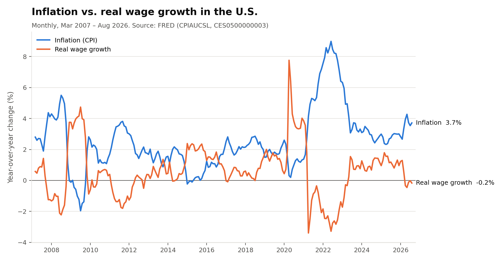
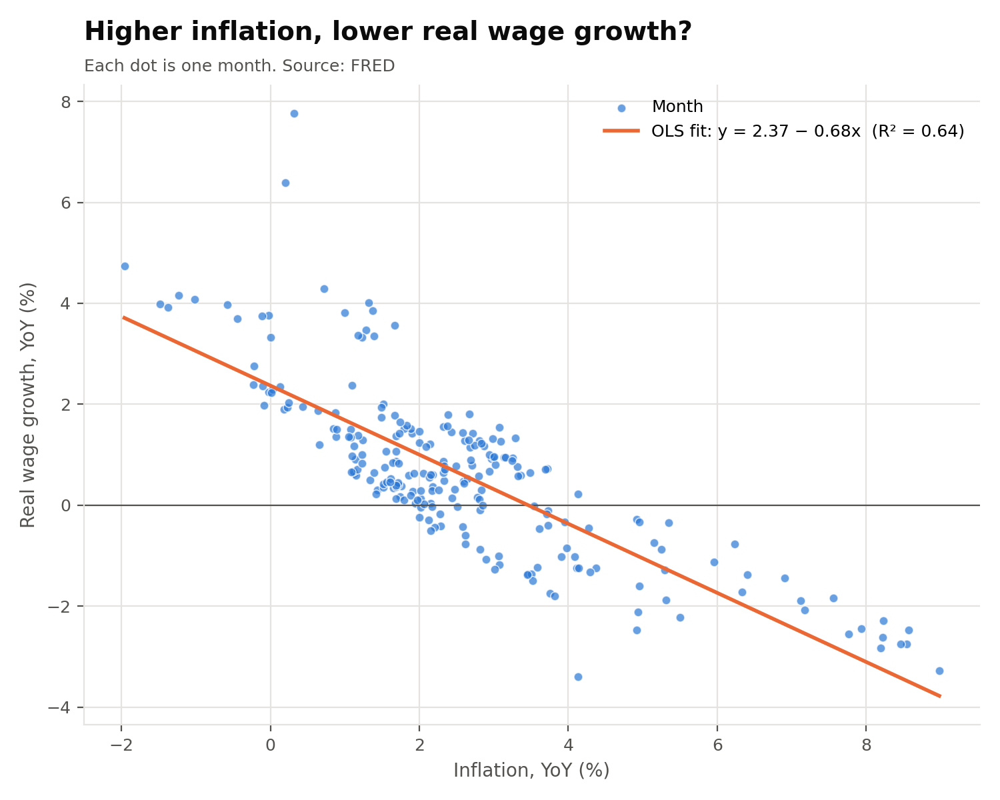

# Results: Inflation and Real Wage Growth in the U.S.

## Data and cleaning

Both series come from FRED and are monthly and seasonally adjusted:

- **CPIAUCSL**: Consumer Price Index for All Urban Consumers (inflation)
- **CES0500000003**: Average Hourly Earnings of All Employees, Total Private (wages)

Cleaning steps (in `analysis.py`):

1. Merged the two series by month and dropped months with missing values.
2. Built a **real wage** by deflating nominal hourly earnings with CPI, expressed in Aug 2026 dollars.
3. Calculated **year-over-year % changes** for CPI (inflation), nominal wages, and real wages.
4. Kept the most recent 20 years. FRED's Average Hourly Earnings series starts in March 2006, and each year-over-year change needs 12 earlier months. So the usable sample runs from **Mar 2007 to Aug 2026 (233 months)**.

The cleaned data is saved in `data/cleaned_data.csv`.

## Charts

**Line chart:** inflation and real wage growth over time

The two lines move as near mirror images. Real wages fell when inflation spiked (2008, 2011, and especially 2021–2023). Real wages grew when inflation was near zero (2009, 2015).

**Scatter plot:** inflation vs. real wage growth

## Regression

Real wage growth = a + b × inflation (OLS, monthly observations)

| | Estimate |
|---|---|
| Intercept (a) | 2.37 |
| Slope (b) | **−0.685** (SE 0.034, p < 0.001) |
| R² | 0.64 |
| Correlation | −0.80 |

Interpretation: each extra percentage point of inflation goes with about **0.69 percentage points lower** real wage growth. Inflation alone explains about 64% of the month-to-month variation in real wage growth.

**Robustness check:** In 2020–2021, many low-wage workers lost their jobs, and that pushed *average* hourly earnings up artificially. That explains the April 2020 spike in the line chart. Dropping those two years leaves the result almost unchanged (slope −0.63, R² = 0.72, n = 209).

## Annual averages (%)

| Year | Inflation | Nominal wage growth | Real wage growth |
|---|---|---|---|
| 2007 | 2.99 | 3.23 | 0.24 |
| 2008 | 3.83 | 3.15 | −0.63 |
| 2009 | −0.31 | 2.81 | 3.15 |
| 2010 | 1.64 | 1.84 | 0.20 |
| 2011 | 3.14 | 2.00 | −1.10 |
| 2012 | 2.08 | 1.90 | −0.17 |
| 2013 | 1.47 | 2.10 | 0.63 |
| 2014 | 1.62 | 2.08 | 0.46 |
| 2015 | 0.12 | 2.25 | 2.13 |
| 2016 | 1.27 | 2.57 | 1.28 |
| 2017 | 2.13 | 2.56 | 0.42 |
| 2018 | 2.44 | 3.01 | 0.56 |
| 2019 | 1.81 | 3.31 | 1.47 |
| 2020 | 1.25 | 4.86 | 3.57 |
| 2021 | 4.68 | 4.28 | −0.35 |
| 2022 | 8.00 | 5.38 | −2.42 |
| 2023 | 4.15 | 4.46 | 0.31 |
| 2024 | 2.95 | 4.04 | 1.06 |
| 2025 | 2.75 | 4.02 | 1.23 |
| 2026* | 3.50 | 3.76 | 0.25 |

*2026 covers January to August only.

## Conclusion

**My expectation is supported.** Periods of higher inflation are clearly associated with lower real wage growth, and the regression shows a strong, statistically significant negative relationship. Nominal wages adjust slowly: their growth stayed between about 2% and 5.4% a year, while inflation swung from −0.3% to 8%. So inflation spikes cut directly into purchasing power. The clearest example is 2022: nominal wages grew 5.4%, but prices rose 8.0%, so real wages fell 2.4%.

**Limitations:** This is a correlation, not proof of causation. Also, real wage growth is partly *defined* by inflation (real growth ≈ nominal growth − inflation). Because nominal wages are sticky, a negative slope is partly built in by that definition. A deeper analysis could regress nominal wage growth on inflation, or add controls such as the unemployment rate.
